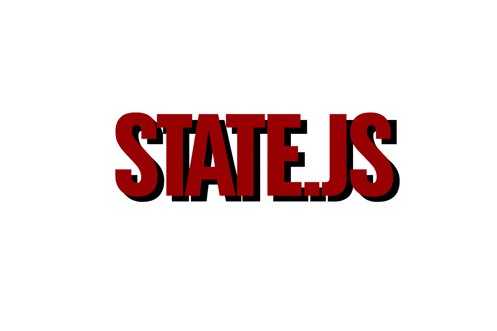

# State.js



**State.js** is a lightweight CSS frontend framework that exposes DOM element states as CSS variables for data-driven animations and reactive UIs. Build dynamic, interactive interfaces using pure CSS and HTML.

[](#license)
[](https://github.com/iDev-Games/State-JS/releases/)

---

## What is State.js?

State.js is a super simple, efficient and lightweight CSS framework that exposes DOM element states as CSS variables. Track data attributes, form inputs, media playback, and element visibility - all automatically exposed for use in your CSS animations and transitions.

**A CSS-first approach to reactive interfaces.**

Using nothing but CSS, HTML and State.js, you can create:
- 📊 Dynamic dashboards and data visualizations
- 🎯 Interactive web applications with writing only CSS
- 🎨 Data-driven animations in CSS
- 🎮 Complex UIs (including game interfaces, health bars, score systems)

State.js is really lightweight and created with vanilla JavaScript without requiring any dependencies. Perfect for CSS-first development and reactive UI patterns!

---

## Installation

### Via NPM
```bash
npm i @idevgames/state-js
```

### Via CDN
```html
<script src="https://cdn.jsdelivr.net/npm/@idevgames/state-js/src/state.js"></script>
```

### Download Directly
Download [state.js](src/state.js) and include it in your project:
```html
<script src="/js/state.js"></script>
```

---

## Quick Start

### 1. Basic Element Visibility Tracking

State.js automatically tracks when elements become visible:

```html
<div class="fadeIn" data-state></div>
```

```css
.fadeIn {
    opacity: 0;
}

.fadeIn.state {
    animation: fadeIn 1s forwards ease-in-out;
}

@keyframes fadeIn {
    0% { opacity: 0; }
    100% { opacity: 1; }
}
```

### 2. Data Attribute Tracking (Progress Bars & Meters)

Watch data attributes and expose them as CSS variables. Here's an example using a health bar (perfect for games, but works for any progress indicator):

```html
<div id="player"
     data-state
     data-state-watch="health,score"
     data-state-var="true"
     data-health="100"
     data-health-min="0"
     data-health-max="100"
     data-score="0">

    <div class="health-bar"></div>
</div>
```

```css
#player .health-bar {
    width: var(--state-health-percent);
    background: linear-gradient(90deg, red 0%, yellow 50%, green 100%);
}

/* Automatically triggered animations */
[data-health="0"] {
    animation: death 2s forwards;
}

[data-health="10"],
[data-health="20"],
[data-health="30"] {
    animation: pulse-red 1s infinite;
}
```

**Update the state** by simply changing the data attribute:

```javascript
// Change health (State.js watches and updates CSS vars automatically)
document.getElementById('player').setAttribute('data-health', '75');
```

### 3. Form Input Tracking with Auto-Binding

**No JavaScript needed!** Automatically bind form inputs to update other elements:

```html
<!-- Input automatically updates the healthBar element -->
<input type="range"
       id="healthSlider"
       data-state
       data-state-bind="healthBar"
       data-state-attr="health"
       min="0"
       max="100"
       value="75">

<!-- This element auto-updates when slider changes -->
<div id="healthBar"
     data-state
     data-state-watch="health"
     data-health="75">

    <div class="bar" style="width: var(--state-health-percent)"></div>
    <span data-state-display="health">75</span>
</div>
```

**Bind to multiple elements** (comma-separated):

```html
<input data-state-bind="player,enemyHealthBar,scoreDisplay" data-state-attr="health">
```

### 4. Button Triggers (No JavaScript!)

**Make any element clickable to control state:**

```html
<!-- Player with power-up state -->
<div id="player"
     data-state
     data-state-toggles="powered"
     data-powered="false">
    Player Character
</div>

<!-- Button that toggles the power-up on/off -->
<button data-state
        data-state-trigger
        data-state-bind="player"
        data-state-toggle="powered">
    Toggle Power-Up
</button>

<!-- Button that sets health to a specific value -->
<button data-state
        data-state-trigger
        data-state-bind="player"
        data-state-attr="health"
        data-state-value="100">
    Full Health
</button>

<!-- Button that increments score by 10 (perfect for clickers!) -->
<button data-state
        data-state-trigger
        data-state-bind="player"
        data-state-attr="score"
        data-state-increment="10">
    Add 10 Points
</button>
```

**Trigger Modes:**

- **Toggle:** `data-state-toggle="attribute"` - Flips between true/false
- **Set:** `data-state-attr="attribute"` + `data-state-value="value"` - Sets specific value
- **Increment:** `data-state-attr="attribute"` + `data-state-increment="amount"` - Adds to current value
- **Decrement:** `data-state-attr="attribute"` + `data-state-decrement="amount"` - Subtracts from current value

**Advanced: Dynamic Calculations**

Both increment and decrement support `calc()` expressions with CSS variables:

```html
<!-- Static increment -->
<button data-state-increment="10">Add 10</button>

<!-- Dynamic: increment scales with level -->
<button data-state-increment="calc(var(--state-level) * 5)">
    Level-scaled Click
</button>

<!-- Dynamic: cost increases with score -->
<button data-state-increment="calc(1 + var(--state-score) * 0.1)">
    Increasing Returns
</button>
```

**Both increment and decrement automatically respect `data-[attr]-min` and `data-[attr]-max` bounds!**

**Conditional Triggers:**

Use `data-state-condition` to only execute operations when a condition is met (perfect for costs, requirements, unlock systems):

```html
<!-- Only works if score >= 20 -->
<button data-state
        data-state-trigger
        data-state-bind="player"
        data-state-attr="level"
        data-state-increment="1"
        data-state-condition="score >= 20">
    Level Up (costs 20)
</button>

<!-- Complex conditions with AND/OR -->
<button data-state-condition="gold >= 100 and level < 10">
    Affordable Upgrade
</button>

<!-- Multiple attributes -->
<button data-state-condition="health > 0 and mana >= 50">
    Cast Spell
</button>
```

When a condition fails, the button gets the `state-disabled` class automatically! Style it with CSS:

```css
.state-disabled {
    opacity: 0.5;
    cursor: not-allowed;
    pointer-events: none;
}
```

**Chaining Multiple Operations:**

Use `data-state-trigger-chain` to perform multiple operations sequentially (perfect for complex game mechanics):

```html
<!-- Level up button that both spends gold AND increases level -->
<button data-state
        data-state-trigger
        data-state-bind="player"
        data-state-condition="gold >= 100"
        data-state-trigger-chain="spendGold,gainLevel">
    Level Up (costs 100 gold)
</button>

<!-- Hidden trigger: deduct gold -->
<button id="spendGold"
        data-state
        data-state-trigger
        data-state-bind="player"
        data-state-attr="gold"
        data-state-decrement="100"
        style="display:none">
</button>

<!-- Hidden trigger: add level -->
<button id="gainLevel"
        data-state
        data-state-trigger
        data-state-bind="player"
        data-state-attr="level"
        data-state-increment="1"
        style="display:none">
</button>
```

**Auto-firing Triggers:**

Use `data-state-autofire="true"` to automatically fire a trigger whenever its condition becomes true (perfect for passive income, auto-unlocks, achievements, and automatic progression):

```html
<!-- Passive income: auto-collect gold whenever it reaches 10 -->
<button id="autoCollect"
        data-state
        data-state-trigger
        data-state-bind="player"
        data-state-attr="gold"
        data-state-decrement="10"
        data-state-condition="gold >= 10"
        data-state-autofire="true"
        data-state-trigger-chain="addScore"
        style="display:none">
</button>

<button id="addScore"
        data-state
        data-state-trigger
        data-state-bind="player"
        data-state-attr="score"
        data-state-increment="10"
        style="display:none">
</button>

<!-- Auto-unlock: automatically upgrade when level reaches 5 -->
<button data-state
        data-state-trigger
        data-state-bind="player"
        data-state-attr="upgraded"
        data-state-set="true"
        data-state-condition="level >= 5"
        data-state-autofire="true"
        style="display:none">
</button>

<!-- Achievement system: auto-trigger when condition met -->
<button data-state
        data-state-trigger
        data-state-bind="achievements"
        data-state-attr="firstWin"
        data-state-set="true"
        data-state-condition="wins >= 1"
        data-state-autofire="true"
        style="display:none">
</button>
```

The magic: When the condition transitions from `false` → `true`, the trigger fires automatically! No click required. No visibility required. **This is the missing primitive for automatic game mechanics.**

**Works with any element:**

```html
<div data-state-trigger data-state-bind="player" data-state-toggle="shielded">
    Click me to toggle shield!
</div>
```

---

## New in v1.1.0: Seven Game Development Extensions

State.js v1.1.0 adds seven powerful declarative primitives specifically designed for game development and interactive experiences. Build complete games with **zero hand-written JavaScript logic**.

### 1. data-state-interval — Repeating Timer Triggers

Automatically fire triggers at regular intervals (perfect for passive income, cooldowns, game ticks):

```html
<!-- Passive gold income: +1 gold every second -->
<button id="passiveGold"
        data-state
        data-state-trigger
        data-state-bind="player"
        data-state-attr="gold"
        data-state-increment="1"
        data-state-interval="1000"
        style="display:none">
</button>

<!-- Health regeneration: +5 HP every 2 seconds (only if alive) -->
<button data-state
        data-state-trigger
        data-state-bind="player"
        data-state-attr="health"
        data-state-increment="5"
        data-state-interval="2000"
        data-state-condition="health > 0 and health < 100"
        style="display:none">
</button>
```

**How it works:**
- Fires the trigger automatically every N milliseconds
- Respects `data-state-condition` (won't fire if condition is false)
- Uses a single efficient shared scheduler for all interval triggers
- Perfect for idle games, passive effects, and time-based mechanics

### 2. data-state-set — Set Exact Value

Set an attribute to an exact value (unlike increment/decrement). Supports `calc()` expressions:

```html
<!-- Reset health to full -->
<button data-state
        data-state-trigger
        data-state-bind="player"
        data-state-attr="health"
        data-state-set="100">
    Full Heal
</button>

<!-- Set mana to half of max -->
<button data-state
        data-state-trigger
        data-state-bind="player"
        data-state-attr="mana"
        data-state-set="calc(var(--state-manamax) / 2)">
    Restore 50% Mana
</button>

<!-- Level-scaled restore -->
<button data-state
        data-state-trigger
        data-state-bind="player"
        data-state-attr="gold"
        data-state-set="calc(var(--state-level) * 100)">
    Set Gold to Level × 100
</button>
```

**Use cases:**
- Reset/restore mechanics
- Level-scaled rewards
- Percentage-based calculations
- Achievement unlocks (set boolean flags)

### 3. data-state-text — Template String Interpolation

Display dynamic text using {token} syntax that updates automatically:

```html
<div id="player"
     data-state
     data-state-watch="level,health,healthmax,gold"
     data-level="1"
     data-health="100"
     data-healthmax="100"
     data-gold="0">
</div>

<!-- Text updates automatically when attributes change -->
<h1 data-state
    data-state-bind="player"
    data-state-text="Level {level} Hero">
</h1>

<p data-state
   data-state-bind="player"
   data-state-text="HP: {health}/{healthmax}">
</p>

<div data-state
     data-state-bind="player"
     data-state-text="Gold: {gold} | Level: {level}">
</div>

<!-- Works with any attribute -->
<span data-state
      data-state-bind="player"
      data-state-text="You have {gold} gold coins!">
</span>
```

**How it works:**
- Replaces `{attributeName}` tokens with current attribute values
- Updates automatically when any referenced attribute changes
- Supports multiple tokens in one template
- No manual display element management required

### 4. data-state-class — Conditional CSS Classes

Dynamically add/remove CSS classes based on conditions:

```html
<!-- Add 'critical' class when health is low -->
<div id="healthBar"
     data-state
     data-state-bind="player"
     data-state-class="critical"
     data-state-class-condition="health <= 20">
</div>

<!-- Multiple conditional classes using numbered suffixes -->
<div id="player"
     data-state
     data-state-bind="game"
     data-state-class="low-health"
     data-state-class-condition="health <= 30"
     data-state-class-2="powered-up"
     data-state-class-condition-2="powerup == true"
     data-state-class-3="max-level"
     data-state-class-condition-3="level >= 99">
</div>

<!-- Style the classes in CSS -->
<style>
.critical {
    animation: critical-pulse 0.5s infinite;
    border: 3px solid red;
}

.low-health {
    filter: hue-rotate(180deg);
}

.powered-up {
    box-shadow: 0 0 20px gold;
    animation: glow 1s infinite;
}

.max-level {
    background: linear-gradient(45deg, gold, orange);
}
</style>
```

**Features:**
- Supports up to 10 class/condition pairs per element (use `-2`, `-3`, etc.)
- Classes add/remove automatically when conditions change
- Perfect for visual state feedback
- Works with any CSS animations or effects

### 5. data-state-sound — Procedural Sound Effects

Play procedurally generated Web Audio sounds on trigger clicks (no audio files needed!):

```html
<!-- Built-in sounds: click, levelup, buy, error, coin -->
<button data-state
        data-state-trigger
        data-state-bind="player"
        data-state-attr="score"
        data-state-increment="1"
        data-state-sound="click">
    Click (+1 score)
</button>

<button data-state
        data-state-trigger
        data-state-bind="player"
        data-state-attr="level"
        data-state-increment="1"
        data-state-sound="levelup"
        data-state-condition="xp >= 100">
    Level Up!
</button>

<button data-state
        data-state-trigger
        data-state-bind="shop"
        data-state-attr="gold"
        data-state-decrement="50"
        data-state-sound="buy"
        data-state-condition="gold >= 50">
    Buy Item (50g)
</button>

<!-- Error sound when clicking disabled buttons -->
<button data-state
        data-state-trigger
        data-state-sound="error"
        data-state-condition="gold >= 1000">
    Expensive Item (1000g)
</button>

<!-- Coin pickup sound -->
<button data-state
        data-state-trigger
        data-state-bind="player"
        data-state-attr="gold"
        data-state-increment="10"
        data-state-sound="coin">
    Collect Gold
</button>
```

**Built-in sounds:**
- **click** - 80ms sawtooth beep (UI feedback)
- **levelup** - 3-note arpeggio C4→E4→G4 (achievements)
- **buy** - 100ms sine tone at 600Hz (purchases)
- **error** - 80ms square wave at 120Hz (failures)
- **coin** - Rising pitch 880→1200Hz (pickups)

**Features:**
- Zero external dependencies (uses Web Audio API)
- Procedurally generated (no audio files to load)
- Plays on trigger click before executing the action
- Respects browser autoplay policies

### 6. data-state-persist — localStorage Save/Restore

Automatically save and restore state to localStorage:

```html
<div id="gameState"
     data-state
     data-state-watch="level,gold,health,xp"
     data-state-persist="true"
     data-state-persist-key="my-game-save"
     data-level="1"
     data-gold="0"
     data-health="100"
     data-xp="0">
</div>
```

**How it works:**
- Automatically loads saved state on page load
- Saves changes to localStorage with 500ms debounce (prevents excessive writes)
- Saves all attributes listed in `data-state-watch`
- Uses element ID as save key if `data-state-persist-key` not specified
- Perfect for idle games, progress persistence, user preferences

**Clear saved data:**
```javascript
// From browser console or your own JS:
localStorage.removeItem('my-game-save');
```

### 7. data-state-event — CustomEvent Dispatch

Dispatch CustomEvents when triggers fire (perfect for external integrations, analytics, achievements):

```html
<!-- Dispatch event when score increases -->
<button data-state
        data-state-trigger
        data-state-bind="player"
        data-state-attr="score"
        data-state-increment="10"
        data-state-event="score-increased">
    +10 Score
</button>

<!-- Listen to events in JavaScript -->
<script>
document.addEventListener('state:score-increased', (e) => {
    console.log('Score changed!', e.detail);
    // e.detail contains:
    // {
    //   element: <the trigger button>,
    //   attr: "score",
    //   oldValue: "0",
    //   newValue: "10",
    //   boundId: "player"
    // }
});

// Track level-ups
document.addEventListener('state:level-up', (e) => {
    // Send to analytics
    gtag('event', 'level_up', { level: e.detail.newValue });
});

// Achievement tracking
document.addEventListener('state:achievement-unlocked', (e) => {
    showNotification(`Achievement unlocked: ${e.detail.attr}!`);
});
</script>
```

**Use cases:**
- Analytics integration
- Achievement systems
- External UI updates
- Debug logging
- Third-party integrations

**Event naming:**
- Event name is prefixed with `state:` (e.g., `data-state-event="win"` → `state:win`)
- Events bubble up the DOM
- Not cancelable (fire-and-forget)

---

## Complete Game Example (Zero JavaScript Logic)

Combining all extensions, here's a complete idle clicker game:

```html
<div id="game"
     data-state
     data-state-watch="gold,goldPerClick,goldPerSecond,level"
     data-state-persist="true"
     data-state-persist-key="idle-game-v1"
     data-gold="0"
     data-goldPerClick="1"
     data-goldPerSecond="0"
     data-level="1">

    <!-- Display with template interpolation -->
    <h1 data-state
        data-state-bind="game"
        data-state-text="Level {level} Miner">
    </h1>

    <p data-state
       data-state-bind="game"
       data-state-text="Gold: {gold} | Per Click: {goldPerClick} | Per Second: {goldPerSecond}">
    </p>

    <!-- Manual clicking -->
    <button data-state
            data-state-trigger
            data-state-bind="game"
            data-state-attr="gold"
            data-state-increment="calc(var(--state-goldPerClick))"
            data-state-sound="coin"
            data-state-event="gold-mined">
        Mine Gold
    </button>

    <!-- Upgrades with conditional classes -->
    <button id="upgradeClick"
            data-state
            data-state-trigger
            data-state-bind="game"
            data-state-trigger-chain="payUpgrade,addPower"
            data-state-condition="gold >= 50"
            data-state-sound="buy"
            data-state-class="affordable"
            data-state-class-condition="gold >= 50">
        Upgrade Pickaxe (50g)
    </button>

    <!-- Hidden triggers for upgrade chain -->
    <button id="payUpgrade"
            data-state-trigger
            data-state-bind="game"
            data-state-attr="gold"
            data-state-decrement="50"
            style="display:none">
    </button>

    <button id="addPower"
            data-state-trigger
            data-state-bind="game"
            data-state-attr="goldPerClick"
            data-state-increment="1"
            style="display:none">
    </button>

    <!-- Passive income with intervals -->
    <button data-state
            data-state-trigger
            data-state-bind="game"
            data-state-attr="gold"
            data-state-increment="calc(var(--state-goldPerSecond))"
            data-state-interval="1000"
            data-state-condition="goldPerSecond > 0"
            style="display:none">
    </button>

    <!-- Auto-level-up when gold reaches threshold -->
    <button data-state
            data-state-trigger
            data-state-bind="game"
            data-state-attr="level"
            data-state-increment="1"
            data-state-condition="gold >= 500"
            data-state-autofire="true"
            data-state-sound="levelup"
            data-state-event="level-up"
            style="display:none">
    </button>
</div>

<style>
/* Visual feedback with conditional classes */
.affordable {
    background: gold;
    animation: pulse 0.5s infinite;
}

#game[data-level="10"],
#game[data-level="25"],
#game[data-level="50"] {
    animation: milestone-celebration 1s ease-out;
}
</style>
```

**This game has:**
- ✅ Manual clicking with dynamic rewards
- ✅ Upgrade system with costs
- ✅ Passive income ticking every second
- ✅ Auto-level-up when reaching milestones
- ✅ Sound effects for all actions
- ✅ Visual feedback for affordability
- ✅ Persistent save/load with localStorage
- ✅ Event dispatch for analytics/achievements
- ✅ **ZERO hand-written game logic JavaScript!**

---

## CSS Variables Created

State.js automatically creates CSS variables based on your configuration:

### Visibility & Position
- `--state-visible` (0 or 1)
- `--state-intersection` (0-100%)
- `--state-viewport-x` (0-100%)
- `--state-viewport-y` (0-100%)

### Watched Data Attributes
When using `data-state-watch="health,score,level"`:

- `--state-health` (raw value)
- `--state-health-percent` (0-100%)
- `--state-health-normalized` (0-1)
- `--state-health-deg` (0-360deg)
- `--state-health-reverse` (100%-0%)
- `--state-score` (raw value)
- `--state-level` (raw value)

### Form Inputs
- `--state-value` (current value)
- `--state-value-percent` (percentage of range)
- `--state-min`, `--state-max` (range bounds)

### Media Elements
- `--state-time` (current time)
- `--state-progress` (0-100%)
- `--state-playing` (0 or 1)
- `--state-volume` (0-100)

### Dimensions
- `--state-width` (px)
- `--state-height` (px)
- `--state-aspect-ratio` (calculated)

---

## Data Attributes API

### Activation
```html
<div data-state></div>
<!-- OR -->
<div class="enable-state"></div>
```

### Configuration Attributes

| Attribute | Description | Example |
|-----------|-------------|---------|
| `data-state-var="true"` | Enable all CSS variables | `data-state-var="true"` |
| `data-state-watch="attr1,attr2"` | Watch specific data attributes | `data-state-watch="health,mana,xp"` |
| `data-state-bind="id1,id2"` | Auto-bind input to element IDs | `data-state-bind="player,enemy"` |
| `data-state-attr="attrName"` | Which attribute to update when binding | `data-state-attr="health"` |
| `data-state-value="value"` | Value to set when trigger is clicked (supports calc()) | `data-state-value="100"` or `calc(var(--state-level) * 10)` |
| `data-state-increment="amount"` | Amount to add when trigger is clicked (supports calc(), respects min/max) | `data-state-increment="10"` or `calc(var(--state-level) * 5)` |
| `data-state-decrement="amount"` | Amount to subtract when trigger is clicked (supports calc(), respects min/max) | `data-state-decrement="5"` or `calc(var(--state-cost))` |
| `data-state-trigger` | Make element clickable to trigger state changes | `data-state-trigger` |
| `data-state-trigger-chain="id1,id2"` | Click other triggers sequentially after this one | `data-state-trigger-chain="payCost,addLevel"` |
| `data-state-condition="expression"` | Only execute if condition is true (adds `state-disabled` class when false) | `data-state-condition="score >= 20"` or `"gold >= 100 and level < 10"` |
| `data-state-autofire="true"` | Automatically fire trigger when condition becomes true (requires `data-state-condition`) | `data-state-autofire="true"` |
| `data-state-toggle="attrName"` | Toggle boolean attribute on/off when clicked | `data-state-toggle="powered"` |
| `data-state-display="attrName"` | Auto-display attribute value as text | `data-state-display="health"` |
| **NEW v1.1.0** | **Game Development Extensions** | |
| `data-state-interval="ms"` | Auto-fire trigger every N milliseconds (respects conditions) | `data-state-interval="1000"` |
| `data-state-set="value"` | Set attribute to exact value (supports calc()) | `data-state-set="100"` or `calc(var(--state-max))` |
| `data-state-text="template"` | Template string with {token} interpolation | `data-state-text="HP {health}/{healthmax}"` |
| `data-state-class="className"` | Conditional CSS class application | `data-state-class="critical"` |
| `data-state-class-condition="expr"` | Condition for class (use with data-state-class) | `data-state-class-condition="health <= 20"` |
| `data-state-sound="soundName"` | Play Web Audio sound on trigger (click, levelup, buy, error, coin) | `data-state-sound="coin"` |
| `data-state-persist="true"` | Auto-save/restore to localStorage | `data-state-persist="true"` |
| `data-state-persist-key="key"` | localStorage key (optional, defaults to element ID) | `data-state-persist-key="my-game"` |
| `data-state-event="eventName"` | Dispatch CustomEvent as "state:eventName" | `data-state-event="score-up"` |
| **NEW v1.2.0** | **HTML Includes** | |
| `data-state-include="path"` | Fetch and inject HTML component from URL | `data-state-include="components/card.html"` |
| `data-state-toggles="attr1,attr2"` | Boolean state toggles | `data-state-toggles="active,locked"` |
| `data-state-dimensions="true"` | Track width/height | `data-state-dimensions="true"` |
| `data-state-media="true"` | Track media playback | `data-state-media="true"` |
| `data-state-global="true"` | Set CSS vars on `:root` | `data-state-global="true"` |
| `data-state-increment="10"` | Update increment for selectors | `data-state-increment="10"` |

### Per-State Configuration

```html
<div data-state
     data-state-watch="health"
     data-health="100"
     data-health-min="0"
     data-health-max="100">
</div>
```

---

## New in v1.2.0: HTML Includes

**Build reusable, modular HTML components** - just like any modern framework, but with zero build tools.

HTML Includes let you fetch and inject components declaratively. Create a component once, use it everywhere. Perfect for health bars, UI cards, player stats, inventory items, or any repeating UI pattern.

### Basic Usage

```html
<!-- Simple include -->
<div data-state-include="components/health-bar.html"></div>

<!-- Override component attributes -->
<div data-state-include="components/health-bar.html"
     id="player-health"
     data-hp="75"
     data-hp-max="150"></div>

<!-- Element tag doesn't matter, gets replaced -->
<i data-state-include="components/icon.html"></i>
```

### Creating a Component

**components/health-bar.html:**
```html
<div class="health-bar"
     data-state
     data-state-watch="hp"
     data-state-var="true"
     data-hp="100"
     data-hp-max="100">
    <div class="fill" style="width: var(--state-hp-percent); background: green; height: 20px;"></div>
    <span data-state-display="hp"></span>
</div>
```

### How It Works

1. **Fetches** HTML from the specified URL
2. **Caches** content (one request per component per page load)
3. **Merges** attributes from the include element to the fetched component
4. **Replaces** the include element with the component
5. **Initializes** State.js on the injected component and all its children

All State.js features (triggers, persistence, intervals, sounds, etc.) work perfectly in included components!

### Use Cases

- **Health/Mana Bars** - Define once, use for player, enemies, NPCs
- **Inventory Items** - Consistent item cards across inventory, shop, tooltip
- **UI Cards** - Stat displays, achievement cards, notifications
- **Player Stats** - Level, XP, gold displays
- **Navigation** - Shared headers, footers, menus across pages

### Configuration

| Attribute | Description | Example |
|-----------|-------------|---------|
| `data-state-include="path"` | Fetch and inject HTML from URL | `data-state-include="components/card.html"` |

**Note:** Any other attributes on the include element are copied to the injected component, allowing you to override default values.

**Local Development:** HTML Includes require HTTP/HTTPS (browser security prevents `file://` fetching). Run any simple local server - Python's `python -m http.server`, Node's `npx http-server`, or VS Code Live Server. Once deployed, works anywhere with zero config!

---

## State-Animations.css

State.js includes **state-animations.css** - a companion stylesheet with predefined animations for common UI patterns and interactive elements.

### Include in your project:
```html
<link rel="stylesheet" href="src/state-animations.css">
```

### Available Animation Classes:

#### UI Feedback & Notifications
- `.state-notification` - Notification slide
- `.state-warning` - Warning shake
- `.state-success` - Success bounce
- `.state-error` - Error shake
- `.state-loading` - Loading spin

#### Progress & Meter States
- `.state-health-low` - Low value warning pulse
- `.state-health-critical` - Critical state shake
- `[data-health="0"]` - Empty state animation
- `[data-health="100"]` - Full/complete glow

#### Counter & Score Animations
- `.state-score-increase` - Value increase pop
- `.state-score-milestone` - Milestone celebration
- `.state-level-up` - Level/tier change flash

#### Status Indicators
- `.state-powered` - Active/powered state glow
- `.state-invincible` - Protected state shimmer
- `.state-shielded` - Shield/protection pulse
- `.state-stunned` - Disabled/paused effect
- `.state-poisoned` - Negative effect pulse
- `.state-frozen` - Frozen/locked shake
- `.state-burning` - Active damage flicker
- `.state-healing` - Positive effect sparkle

[View full animation documentation →](animations.html)

---

## Advanced Examples

### Multi-Attribute UI Component (Character Stats Demo)

```html
<div id="player"
     data-state
     data-state-watch="health,mana,xp,level"
     data-state-var="true"
     data-health="100"
     data-mana="80"
     data-xp="450"
     data-level="5"
     data-health-max="100"
     data-mana-max="100"
     data-xp-max="1000">

    <div class="health-bar" style="width: var(--state-health-percent)"></div>
    <div class="mana-bar" style="width: var(--state-mana-percent)"></div>
    <div class="xp-bar" style="width: var(--state-xp-percent)"></div>
    <div class="level">Level <span style="--content: var(--state-level)"></span></div>
</div>
```

### Video Progress Indicator

```html
<video data-state
       data-state-media="true"
       data-state-var="true">
    <source src="video.mp4">
</video>

<style>
    video::after {
        content: "";
        width: var(--state-progress);
        height: 5px;
        background: red;
        position: absolute;
        bottom: 0;
        left: 0;
    }
</style>
```

### Boolean Toggle States

```html
<div data-state
     data-state-toggles="active,locked,complete"
     data-active="true"
     data-locked="false"
     data-complete="false">
</div>
```

```css
/* Automatically applied classes */
.state-active {
    filter: brightness(1.2);
    transform: scale(1.05);
}

.state-locked {
    filter: grayscale(1) brightness(0.6);
    cursor: not-allowed;
}

.state-complete {
    animation: complete-check 0.5s forwards;
}
```

### Clicker Game (Zero JavaScript!)

```html
<div id="clicker"
     data-state
     data-state-watch="score"
     data-state-var="true"
     data-score="0"
     data-score-max="100">

    <h1>Score: <span data-state-display="score">0</span></h1>

    <button data-state
            data-state-trigger
            data-state-bind="clicker"
            data-state-attr="score"
            data-state-increment="1">
        Click Me!
    </button>
</div>

<style>
/* Celebrate milestones with CSS alone */
#clicker[data-score="10"],
#clicker[data-score="20"],
#clicker[data-score="30"] {
    animation: milestone-burst 0.5s ease-out;
}

#clicker[data-score="100"] {
    animation: victory-flash 1s ease-out;
}

/* Progress bar using CSS variables */
#clicker::after {
    content: "";
    width: var(--state-score-percent);
    height: 10px;
    background: linear-gradient(90deg, red, yellow, green);
}
</style>
```

### Volume Control (Increment & Decrement with Auto-Clamping)

```html
<div id="audio"
     data-state
     data-state-watch="volume"
     data-state-var="true"
     data-volume="50"
     data-volume-min="0"
     data-volume-max="100">

    <h2>Volume: <span data-state-display="volume">50</span>%</h2>

    <!-- Decrement button (auto-stops at 0) -->
    <button data-state
            data-state-trigger
            data-state-bind="audio"
            data-state-attr="volume"
            data-state-decrement="10">
        -
    </button>

    <!-- Increment button (auto-stops at 100) -->
    <button data-state
            data-state-trigger
            data-state-bind="audio"
            data-state-attr="volume"
            data-state-increment="10">
        +
    </button>

    <!-- Visual bar updates automatically -->
    <div class="volume-bar" style="width: var(--state-volume-percent);"></div>
</div>
```

### Idle Game with Dynamic Scaling (No JavaScript!)

```html
<div id="idleGame"
     data-state
     data-state-watch="gold,level,clickPower"
     data-state-var="true"
     data-gold="0"
     data-level="1"
     data-clickPower="1">

    <h1>Gold: <span data-state-display="gold">0</span></h1>
    <h2>Level: <span data-state-display="level">1</span></h2>
    <p>Click Power: <span data-state-display="clickPower">1</span></p>

    <!-- Basic click: adds clickPower to gold -->
    <button data-state
            data-state-trigger
            data-state-bind="idleGame"
            data-state-attr="gold"
            data-state-increment="calc(var(--state-clickPower))">
        Mine Gold
    </button>

    <!-- Upgrade: increases clickPower, costs gold -->
    <button data-state
            data-state-trigger
            data-state-bind="idleGame"
            data-state-attr="clickPower"
            data-state-increment="1">
        Upgrade Pick (+1 power)
    </button>

    <!-- Level up: costs increase with level -->
    <button data-state
            data-state-trigger
            data-state-bind="idleGame"
            data-state-attr="level"
            data-state-increment="1">
        Level Up
    </button>
</div>

<style>
/* Different animations per level */
#idleGame[data-level="5"],
#idleGame[data-level="10"] {
    animation: level-milestone 1s ease-out;
}

/* Click power visualization */
#idleGame::after {
    content: "";
    width: calc(var(--state-clickPower) * 10px);
    height: 5px;
    background: gold;
}
</style>
```

---

## Integration with Other Libraries

State.js is part of a complete CSS/HTML UI development toolkit from iDev Games:

### The iDev Games CSS Framework Suite

**Five libraries working together for pure CSS/HTML interactive experiences:**

1. **[Keys.js](https://github.com/iDev-Games/Keys-JS)** - Keyboard input tracking
   - `--key-space`, `--key-up`, `--key-down`, etc.

2. **[Cursor.js](https://github.com/iDev-Games/Cursor-JS)** - Mouse position tracking
   - `--cursor-x`, `--cursor-y`, `--cursor-speed`, etc.

3. **[Touch.js](https://github.com/iDev-Games/Touch-JS)** - Touch gesture tracking
   - `--touch-x`, `--touch-velocity-x`, `--touch-distance`, etc.

4. **[Motion.js](https://github.com/iDev-Games/Motion-JS)** - Time/animation tracking
   - `--motion-progress`, `--motion-time`, `--motion-loop`, etc.

5. **State.js** ⭐ - UI state & data binding
   - `--state-health`, `--state-score`, `--state-level`, etc.

### Combined Example

```html
<div id="game"
     data-state
     data-state-watch="health,score"
     data-health="100"
     data-score="0"

     data-cursor
     data-cursor-var="true"

     data-keys
     data-keys-watch="space,up,down">

    <!-- Health bar follows cursor -->
    <div class="health-bar" style="
        width: var(--state-health-percent);
        transform: translateY(var(--cursor-y));
    "></div>

    <!-- Score pulses when space pressed -->
    <div class="score" style="
        transform: scale(calc(1 + var(--key-space) * 0.5));
    ">
        Score: <span data-state-value="score"></span>
    </div>
</div>

<style>
    /* When health is low AND cursor is idle */
    body.cursor-idle [data-health="10"],
    body.cursor-idle [data-health="20"] {
        animation: warning-pulse 1s infinite;
    }

    /* When up arrow pressed AND health full */
    .key-up[data-health="100"] {
        animation: victory-jump 0.5s ease-out;
    }
</style>
```

**Result:** A complete interactive UI system with dynamic data, user input tracking, and reactive animations - all in CSS! Perfect for games, dashboards, data visualizations, and interactive experiences.

---

## Browser Support

State.js uses modern browser APIs:
- IntersectionObserver API
- MutationObserver API
- CSS Custom Properties

**Supported browsers:**
- Chrome/Edge 58+
- Firefox 55+
- Safari 12.1+
- Opera 45+

---

## Performance

State.js is optimized for performance:
- ✅ Passive event listeners
- ✅ requestAnimationFrame for DOM updates
- ✅ Map-based attribute caching
- ✅ Conditional updates (only when values change)
- ✅ Efficient MutationObserver usage

---

## Documentation

- [Live Demo & Documentation](index.html)
- [state-Animations.css Documentation](animations.html)
- [GitHub Repository](https://github.com/iDev-Games/State-JS)

---

## Examples

Check out the documentation page code as an example:
[https://github.com/iDev-Games/State-JS/blob/master/index.html](https://github.com/iDev-Games/State-JS/blob/master/index.html)

---

## Philosophy

**Declarative over Imperative**

State.js follows the same philosophy as all iDev Games libraries:
- ✅ Describe what you want (HTML data attributes)
- ✅ Style how it looks (CSS)
- ❌ No complex JavaScript APIs to learn
- ❌ No framework dependencies

**The goal:** Enable developers to build reactive, data-driven interfaces using HTML and CSS skills they already have - whether for dashboards, web apps, visualizations, or games.

---

## License

MIT License - see [LICENSE](LICENSE) file for details

---

## Author

**iDev Games**

- GitHub: [@iDev-Games](https://github.com/iDev-Games)
- Dev.to: [@idevgames](https://dev.to/idevgames)

---

## Contributing

Contributions, issues, and feature requests are welcome!

Feel free to check the [issues page](https://github.com/iDev-Games/State-JS/issues).

---

## Show your support

Give a ⭐️ if this project helped you!

